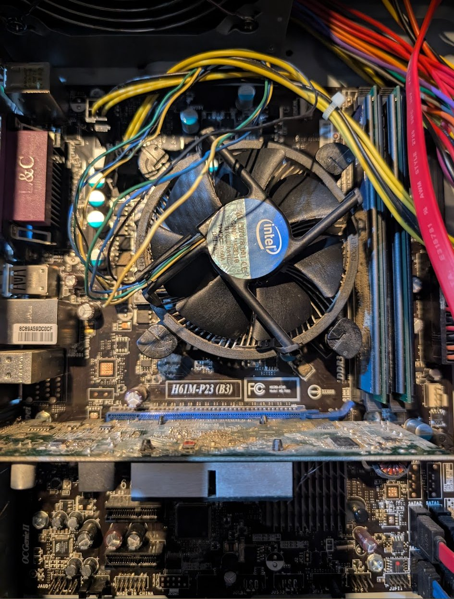
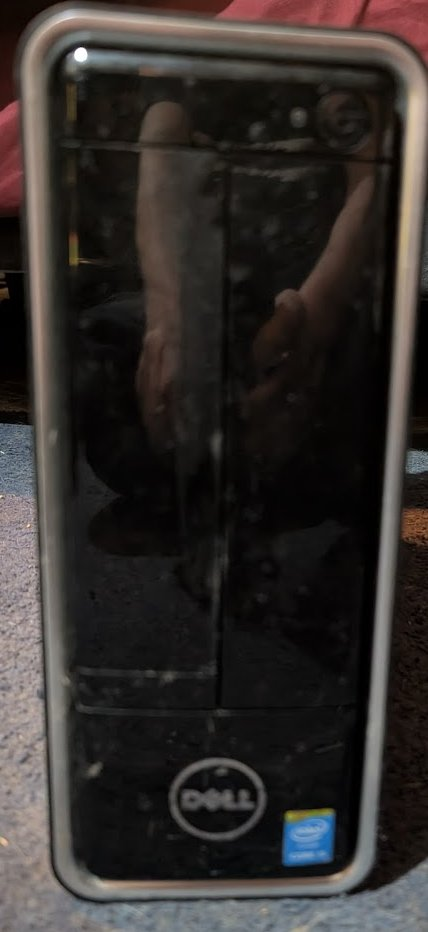
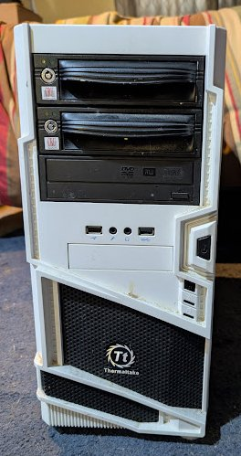
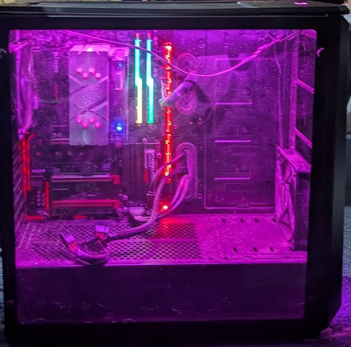
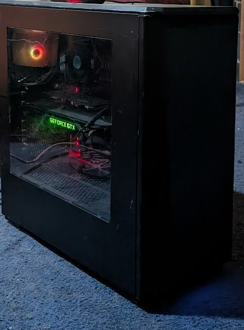

# Hardware Inventory
_Last updated: 2026-04-13_
_Physical hosts only — VMs/containers documented in network_context.md_
_Ordered by utility — least capable first, most capable last_

!!! tip "Adding Photos"
    Save host photos to `docs/images/hw/` and name them to match the image references below (e.g. `proxmox-deb.jpg`).

---

## Ewaste / Recycled

| Photo | System | Reason |
|-------|--------|--------|
| { width=100 } | MSI H61M-P23 (B3) — LGA1155 | Broken CPU cooler, won't POST — recycled |

---

## lee-deb (192.168.1.29) — Dell Inspiron 3647

| | |
|--|--|
| { width=300 } | **Role:** Immich photo server — memorial machine **Make:** Dell Inspiron 3647 (Small Form Factor) **Chipset:** Intel H81 (Haswell, 2013) **CPU:** Unknown — up to i7-4790 (4th gen) **RAM:** Unknown — max 16GB DDR3 **Storage:** Samsung 870 EVO 1TB SSD (pending install) **OS:** Ubuntu Server 22.04 LTS (pending install) **IP:** 192.168.1.29 (pending) **PSU:** 220W — low-profile GPU only **Name:** lee — personal/memorial **Best uses:** Immich photo server, lightweight Linux utility box, PiHole **Easy upgrades:** SSD already planned. RAM cheap if needed. **Notes:** Sentimental machine — belongs to family. Original HDD preserved as-is. |

---

## eld-win (192.168.1.101)

| | |
|--|--|
| { width=300 } | **Role:** Restic backup server — pending Ubuntu 26.04 migration **Motherboard:** Gigabyte Z77-DS3H (Intel Z77, LGA1155) **CPU:** Intel Core i5-2500K @ 3.30GHz (Sandy Bridge 2011) **RAM:** 16GB DDR3 1600MHz (4x 4GB matched kit) **RAM max:** 32GB DDR3 (4x 8GB) — DDR3 is cheap, easy upgrade **BIOS:** AMI 2012-08-20 **OS:** Windows 10 (EOL) **Form factor:** Thermaltake white full tower — 2x CRU hot-swap bays, USB 3.0 front panel **Storage:** Disk 0: 238GB SSD (C: OS, 38% free) + Disk 1: 2.79TB HDD (D: Patreon O-Z, 10% free ⚠️) + DVD drive **Best uses:** Restic backup server, manual CRU drive rotation, offsite cold storage **Easy upgrades:** Upgrade RAM to 32GB DDR3 before Ubuntu migration — stock available. Add drives to CRU bays. **Backup role:** Tier 1 — Restic automated. Tier 2 — 2x CRU bays rotating drives. Tier 3 — offsite cold storage. |

---

## freenas-bsd (192.168.1.5)

| | |
|--|--|
| { width=300 } | **Role:** NAS — primary storage **Motherboard:** Gigabyte Z77-DS3H (Intel Z77, LGA1155) **CPU:** Intel Core i5-3570K @ 3.40GHz (4 cores) — Ivy Bridge 2012 **RAM:** 24GB DDR3 1600MHz — 4x DIMM: 4GB Hynix + 8GB Samsung + 4GB Hynix + 8GB Samsung (mixed) **BIOS:** AMI F9 (2012-09-19) **OS:** FreeNAS 11.2-U8 (2020-02-14) — EOL **Hostname:** freenas.local **Form factor:** Beige full tower ATX (~1999) — 5x CRU hot-swap bays, PS2 logo on front panel, floppy drives, DVD — 27 years old and still holding 45TB of data. Legend. **RAM max:** 32GB DDR3 (4x 8GB) — currently 24GB mixed kit, could upgrade to 32GB **Best uses:** NAS — irreplaceable 45TB RAIDZ1 pool. Keep running until TrueNAS migration. **Easy upgrades:** New mobo with ECC support + TrueNAS Community Edition. Drives and case stay, ZFS pool imports cleanly. **History:** Case bought 1999. TRYAGAIN pool survived a motherboard failure — imported in 30 minutes after emergency mobo swap. No data loss. Has run continuously since at least April 2022. |

### Storage
| Pool | Drives | Size each | Raw Total | Layout | Status | Used | Free |
|------|--------|-----------|-----------|--------|--------|------|------|
| TRYAGAIN | 5x (ada0-ada4) | 18.19TiB | 90TB raw / 70TB usable (RAIDZ1) | RAIDZ1 — 1 drive parity | HEALTHY | 45TB used (65%) | 24.6TiB |
| freenas-boot | 2x (da0, da1) | ~14GB | ~28GB | Mirror | ONLINE | — | — |

### TRYAGAIN Datasets
| Dataset | Type | Used | Notes |
|---------|------|------|-------|
| plex | dataset | 44.45TiB | Main media — CIFS mounted on mediastack-deb |
| jails | dataset | 1.15TiB | plex-plexpass (.143 weltgeist) + plex-plexpass_2 (.144 alea_iacta_est) |
| iocage | dataset | 91.74GiB | Jail manager |
| QUANTUM-g52439 | zvol | 25.61GiB | VM or iSCSI target |

### ZFS Health
- Last scrub: 2026-04-06 — 0 errors
- Read/Write/Checksum errors: 0 on all drives
- One drive failure tolerance (RAIDZ1)

---

## Raspberry Pis

| Photo | Hostname | IP | Model | CPU | RAM | Storage | Best Use | Status |
|-------|----------|----|-------|-----|-----|---------|----------|--------|
| { width=100 } | pi3-deb | 192.168.1.124 | RPi Model B Rev 2 (BCM2835) Rev 000e — 256MB — clear RetroPie case | ARM 1-core | 239MB | 15GB SD | RetroPie/Buster — legacy, Python 3.7, cannot Ansible manage. Keep as NES/SNES/GB only. | Online |
| { width=100 } | pi1-deb | 192.168.1.120 | RPi Model B Rev 2 (BCM2835) Rev 000f — 512MB — blue-green case | ARM 1-core | 427MB | 3.8GB SD (91% full ⚠️) | Raspbian Bookworm — onboarded ✅ — Secondary PiHole or MQTT broker. Needs larger SD card. | Online |
| { width=100 } | pi2-deb | 192.168.1.121 | RPi Model B Rev 2 (BCM2835) Rev 000f — 512MB — bare board | ARM 1-core | 475MB | 7.2GB SD | DietPi — onboarded ✅ — MQTT broker for HA IoT | Online |
| { width=100 } | pi4-deb | 192.168.1.126 | RPi 2 Model B Rev 1.1 (BCM2836) — 1GB — official white case | ARM 4-core | 762MB | 29GB SD | DietPi v10.2.3 — onboarded ✅ — Zigbee coordinator + MQTT broker | Online |
| { width=100 } | octopi-deb | 192.168.1.122 | RPi 4 Model B Rev 1.1 (BCM2711) — CanaKit clear case | ARMv7 4-core | 3.7GB | 29GB SD | OctoPrint — controls Creality Ender 3 V2 | Online |
| { width=100 } | ha-net | 192.168.1.125 | RPi 4 Model B Rev 1.4 — CanaKit black case | ARM 4-core | 3.7GB | 28.6GB | Home Assistant OS 17.2 / Core 2026.4.2 | Online |
| { width=100 } | batocera-deb | 192.168.1.123 | RPi 5 Model B Rev 1.0 | ARM 4-core | 3.9GB | 111GB SD | Best retro gaming — PS2, GameCube, Dreamcast, some Switch (Batocera) | Online |
| { width=100 } | argos-deb | 192.168.1.127 | RPi 4 Model B Rev 1.1 — 1GB — ewaste find! | ARM 4-core | 870MB | 32GB PNY | Fully kitted IoT field station — touchscreen, camera, LTE, LoRa | Online |

---

## argos-deb (192.168.1.127)

| | |
|--|--|
| { width=300 } | **Role:** IoT field station — TBD **Model:** Raspberry Pi 4 Model B Rev 1.1 (BCM2711) **RAM:** 1GB (870MB available) **Storage:** 32GB PNY microSD (Bookworm 64-bit) **OS:** Raspberry Pi OS Bookworm 64-bit — onboarded ✅ **IP:** 192.168.1.127 **Origin:** Ewaste find — someone's serious IoT project **Display:** Official Raspberry Pi 7" touchscreen ✅ working **Camera:** Raspberry Pi Camera V2.1 — untested on Bookworm **Cellular:** Sixfab mPCI-E Base Shield V2 + Quectel EC25-A 4G LTE — needs SIM card **Radio:** Adafruit RFM9x LoRa — long range RF, GPIO connected **Best uses:** Mobile homelab node (Tailscale+LTE), LoRa gateway, security camera, HA kiosk display, field sensor station **Easy upgrades:** Add SIM card (Hologram.io), reconnect Sixfab shield, test LoRa radio |

---

## 3D Printers

| Photo | Printer | Type | Controller | Status | Notes |
|-------|---------|------|-----------|--------|-------|
| { width=100 } | Creality Ender 3 V1 | FDM | None assigned | Needs Pi | Could add another OctoPrint Pi |
| { width=100 } | Elegoo Mars 3 | Resin (MSLA) | None | Standalone | Chitubox slicer, no OctoPrint |
| { width=100 } | Flashforge Dreamer | FDM dual extrusion | None | Standalone | FlashPrint software |
| { width=100 } | Creality Ender 3 V2 | FDM | octopi-deb (OctoPrint) | ✅ Active | Controlled via RPi 4 |

---

## GPU Stock (undeployed)

| Photo | Item | Qty | VRAM | Notes |
|-------|------|-----|------|-------|
| { width=100 } | GTX 1080 | 4 (undeployed) | 8GB each | Pascal NVENC — 1 transcode stream, no AV1 |
| { width=100 } | GTX 1080 Ti | 4-5 total (1 in amontillado, 1 in temerant, 2-3 undeployed) | 11GB VRAM | Best choice for AI/Ollama node — more VRAM than 1080 |

---

## pve3 (offsite — ThinkStation)

| | |
|--|--|
| { width=300 } | **Role:** Proxmox VE node 3 — offsite **Make:** Lenovo ThinkStation (model unknown) **CPU:** Unknown **RAM:** Unknown **Storage:** Unknown **OS:** Proxmox VE **Location:** Offsite **Tailscale:** Not yet configured **Best uses:** Proxmox node 3 — proper 3-node quorum, offsite DR **Notes:** Needs full inventory, Tailscale, and documentation |

---

## Unknown Waiting System

| Photo | # | Notes |
|-------|---|-------|
| { width=100 } | 5 | Unknown — not yet inventoried |

---

## urnst-deb (192.168.1.27)

| | |
|--|--|
| { width=300 } | **Role:** TBD — Proxmox node 3 or PBS candidate **Motherboard:** Gigabyte AB350-Gaming-CF (AMD B350, AM4) **CPU:** AMD Ryzen 5 1600X (6c/12t, 3.6GHz) **RAM:** 8GB DDR4 2133 (1x DIMM, 3 slots empty) **RAM max:** 16GB DDR4 (4x 4GB) **GPU:** AMD Radeon HD 7450 — display only **OS:** Debian 13 (Trixie) — fresh install 2026-04-13 **Form factor:** Thermaltake white full tower — 2x 5.25" bays, front USB **IP:** 192.168.1.27 **Name:** Urnst — County of Urnst, Greyhawk **Best uses:** Proxmox node 3, PBS backup server, general Linux server **Easy upgrades:** Add 3x 4GB DDR4 to reach 16GB max. Replace HD 7450 with GTX 1080/1080 Ti from stock. |

### Storage
| Device | Type | Size | Notes |
|--------|------|------|-------|
| sda | HDD | 2.7TB | OS drive — Debian installed |
| sdb | HDD | 2.7TB | Empty |
| sdc | HDD | 2.7TB | Empty |

---

## maturin (192.168.1.7) — Proxmox node 2

| | |
|--|--|
| { width=300 } | **Role:** Proxmox VE node 2 **Make:** Dell OptiPlex 7050 (SFF) **Motherboard:** Dell 0NW6H5 **CPU:** Intel Core i7-6700 @ 3.40GHz (4c/8t, Skylake 2015) **RAM:** 16GB DDR4 2400MHz (4x 4GB SK Hynix) **RAM max:** 64GB DDR4 (4x 16GB) **BIOS:** Dell 1.11.0 (2018-11-01) **OS:** Proxmox VE / Debian 12 **Storage:** 476.9GB SSD — 96GB root, 348.8GB Proxmox data pool **IP:** 192.168.1.7 **Form factor:** Small form factor desktop **Best uses:** Proxmox node 2 — currently running snipe-it and ubuntu template. Good for lightweight VMs/LXCs. **Easy upgrades:** RAM to 64GB DDR4. Check PCIe slot for low-profile GPU. |

---

## idee-deb (192.168.1.28)

| | |
|--|--|
| { width=300 } | **Role:** TBD — AI node or Proxmox node 3 candidate **Motherboard:** Gigabyte AB350-Gaming 3-CF (AMD B350, AM4) **CPU:** AMD Ryzen 5 1600X (6c/12t, 3.6GHz) **RAM:** 16GB DDR4 2133 dual channel — 2x 8GB G.Skill Trident Z RGB **RAM max:** 128GB DDR4 **Storage:** Samsung 970 EVO Plus 500GB NVMe **GPU:** AMD Radeon HD 7450 (placeholder — display only) **OS:** Debian 13 (Trixie) + GNOME — fresh install 2026-04-13 **Form factor:** Mid-tower, tempered glass side panel, full RGB **IP:** 192.168.1.28 **Name:** Idee — Duchy of Idee, Greyhawk **Best uses:** AI/Ollama node with GTX 1080 Ti, Proxmox node 3, GPU transcoding server **Easy upgrades:** GTX 1080 Ti from stock (biggest single improvement — 11GB VRAM). RAM upgradeable to 128GB DDR4. |

### Storage
| Device | Type | Size | Model | Notes |
|--------|------|------|-------|-------|
| nvme0n1 | NVMe | 465.8GB | Samsung 970 EVO Plus 500GB | OS drive |

---

## temerant-win (192.168.1.105)

| | |
|--|--|
| { width=300 } | **Role:** TBD — AI node candidate, check drives for data first **Motherboard:** Gigabyte AB350-Gaming (AMD B350, AM4) **CPU:** AMD Ryzen 5 1600X (6c/12t, 3.6GHz) **RAM:** 32GB DDR4 2133 (4x 8GB G.Skill F4-2400C15 — full 4 slots) **RAM max:** 64GB DDR4 **GPU:** NVIDIA GeForce GTX 1080 Ti (11GB VRAM) ✅ already installed **OS:** Windows 10 Pro (1909 — EOL, updating) **Form factor:** Mid-tower, tempered glass, AIO cooler, RGB **IP:** 192.168.1.105 **Name:** Temerant — world of Kingkiller Chronicle (Rothfuss) **Best uses:** AI/Ollama node (1080 Ti ready!), GPU workloads, gaming, transcoding **Easy upgrades:** RAM to 64GB DDR4. Migrate to Linux when data checked. More storage. **⚠️ Notes:** Has not been used since before Windows 10 EOL (Oct 2025). Check 2x 3TB HDDs for important data before any OS changes. |

### Storage
| Device | Type | Size | Notes |
|--------|------|------|-------|
| Disk C: | SSD | 500GB | OS drive |
| Disk D: | HDD | 3TB | Seagate ST3000DM001 — check for data ⚠️ |
| Disk E: | HDD | 3TB | Seagate ST3000DM001 — check for data ⚠️ |

---

## shardik (192.168.1.2) — Proxmox node 1

| | |
|--|--|
| { width=300 } | **Role:** Proxmox VE node 1 — primary hypervisor **Motherboard:** ASRock AB350M Pro4 **CPU:** AMD Ryzen 5 1600 (6c/12t) **RAM:** 56GB DDR4 2667MHz — 4x DIMM: 16GB+16GB+16GB+8GB **RAM max:** 64GB — replace 8GB Micron stick to max out **BIOS:** AMI P10.43 (2025-06-24) **OS:** Proxmox VE / Debian 12 **Form factor:** Cooler Master full tower — 5x CRU hot-swap bays, LG optical **IP:** 192.168.1.2 **Best uses:** Primary hypervisor — runs 12 VMs/LXCs including mediastack, docker, swarm, pihole **Easy upgrades:** Replace 8GB Micron with 16GB DDR4 2667 to reach 64GB max. |

### Storage
| Device | Type | Size | Model | FS |
|--------|------|------|-------|----|
| nvme0n1 | NVMe | 1.02TB | Kioxia KXG60ZNV1T02 | LVM (OS) |
| sda | HDD | 6TB | Seagate ST6000DX000 | ext4 |
| sdb | HDD | 6TB | Toshiba HDWE160 | ZFS |
| sdc | HDD | 6TB | Toshiba HDWE160 | ext4 |
| sdd | HDD | 6TB | Seagate ST6000VN0001 | ZFS |

---

## amontillado-win (192.168.1.100) ⭐ Best System

| | |
|--|--|
| { width=300 } | **Role:** Primary workstation / AI powerhouse **Motherboard:** MSI PRO Z690-A WIFI (MS-7D25) **CPU:** Intel i7-13700K (16 cores / 24 threads — Raptor Lake 2022) **RAM:** 128GB DDR5 4000MHz — 4x 32GB: G.Skill + Crucial **BIOS:** AMI A.F0 (2023-11-13) **OS:** Windows 11 + Hyper-V **GPU:** NVIDIA GeForce GTX 1080 Ti (11GB VRAM) + Intel UHD Graphics **Form factor:** Phanteks Eclipse P400A — mesh front, tempered glass, RGB **IP:** 192.168.1.100 **Name:** Amontillado — Poe **Best uses:** Primary workstation, Hyper-V host, AI workloads, heavy compilation, anything that needs 128GB RAM **Easy upgrades:** Upgrade GPU to RTX 3090/4090 for serious AI work — i7-13700K won't bottleneck it. |

### Storage
| Drive | Size | FS | Label | Free |
|-------|------|----|-------|------|
| Disk 0 | 465GB | NTFS | F: | 39% |
| Disk 1 | 2.79TB | NTFS | D: New Volume | 11% ⚠️ |
| Disk 2 | 931GB | NTFS | C: OS | 20% |

---

## To Do
- [ ] Inventory remaining unknown waiting system (#5)
- [ ] Add photo: lee-deb, temerant-win
- [ ] Install Samsung 870 EVO in lee-deb, install Ubuntu Server, deploy Immich
- [ ] Check temerant drives for important data before OS change
- [ ] Get lee-deb MAC, set DHCP reservation at .29
- [ ] Import all hosts into Snipe-IT
- [ ] Confirm git-ansible physical host specs with dmidecode
- [ ] Enable SSH on freenas-bsd and run dmidecode
- [ ] ThinkStation (pve3) — full inventory, Tailscale, add to wheel cluster

