# Hardware Inventory
_Last updated: 2026-04-10_
_Physical hosts only — VMs/containers documented in network_context.md_

!!! tip "Adding Photos"
    Save host photos to `docs/images/hw/` and name them to match the image references below (e.g. `proxmox-deb.jpg`).

---

## proxmox-deb (192.168.1.2)

| | |
|--|--|
| 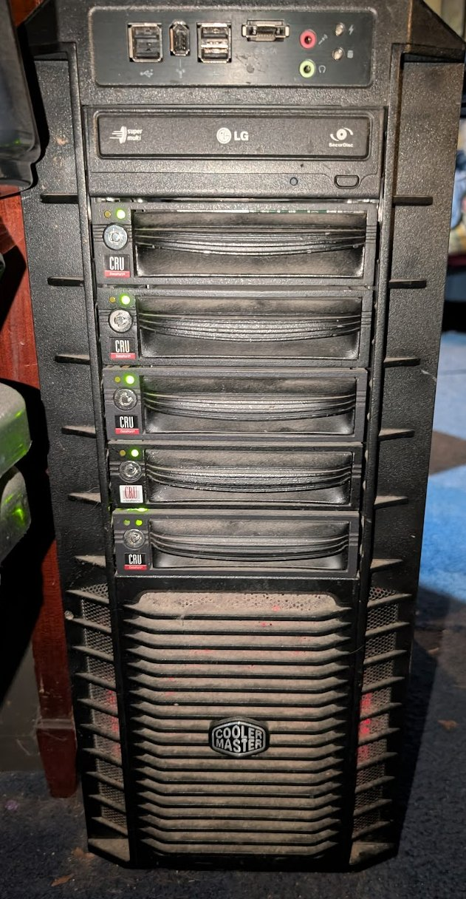{ width=300 } | **Motherboard:** ASRock AB350M Pro4 **Board Serial:** M80-B1011000766 **CPU:** AMD Ryzen 5 1600 (6c/12t) **RAM:** 56GB DDR4 2667MHz **RAM detail:** 4x DIMM: 16GB + 16GB + 16GB (Crucial BLS16G4D26BFST) + 8GB (Micron 8ATF1G64AZ-2G6E1) **RAM max:** 64GB (4x 16GB) — replace 8GB stick to max out **BIOS:** AMI P10.43 (2025-06-24) **Form factor:** Cooler Master full tower — 5x CRU hot-swap bays, LG optical **OS:** Proxmox VE / Debian 12 **Upgrade notes:** Replace 8GB Micron with 16GB DDR4 2667 to reach 64GB max |

### Storage
| Device | Type | Size | Model | FS |
|--------|------|------|-------|----|
| nvme0n1 | NVMe | 1.02TB | Kioxia KXG60ZNV1T02 | LVM (OS) |
| sda | HDD | 6TB | Seagate ST6000DX000 | ext4 |
| sdb | HDD | 6TB | Toshiba HDWE160 | ZFS |
| sdc | HDD | 6TB | Toshiba HDWE160 | ext4 |
| sdd | HDD | 6TB | Seagate ST6000VN0001 | ZFS |

---

## amontillado-win (192.168.1.100)

| | |
|--|--|
| 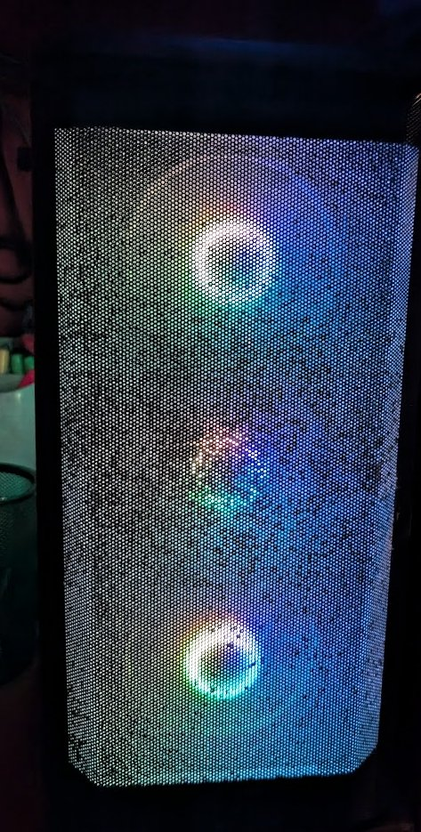{ width=300 } | **Motherboard:** MSI PRO Z690-A WIFI (MS-7D25) **Board Serial:** 07D2521_N31E100868 **CPU:** Intel i7-13700K (24 logical processors) **RAM:** 128GB DDR5 4000MHz **RAM detail:** 4x 32GB: G.Skill F5-5600J2834F32G (x2) + Crucial CT32G48C40U5 (x2) **BIOS:** AMI A.F0 (2023-11-13) **OS:** Windows 11 **Hyper-V:** Enabled **GPU:** NVIDIA GeForce GTX 1080 Ti (11GB VRAM) + Intel UHD Graphics **Form factor:** Phanteks Eclipse P400A (PH-EC400ATG_DWT01) — mesh front panel, tempered glass side, RGB |

### Storage
| Drive | Size | FS | Label | Free |
|-------|------|----|-------|------|
| Disk 0 | 465GB | NTFS | F: | 39% |
| Disk 1 | 2.79TB | NTFS | D: New Volume | 11% ⚠️ |
| Disk 2 | 931GB | NTFS | C: OS | 20% |

---

## freenas-bsd (192.168.1.5)

| | |
|--|--|
| 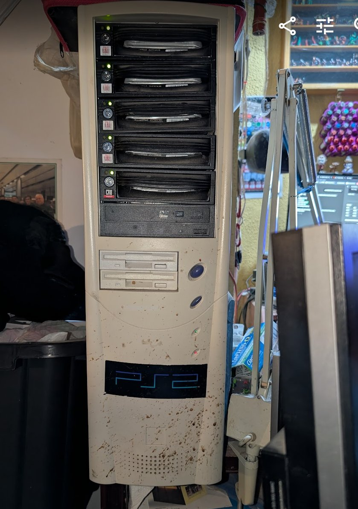{ width=300 } | **Role:** NAS — primary storage **Motherboard:** Gigabyte Z77-DS3H (Intel Z77, LGA1155) **CPU:** Intel Core i5-3570K @ 3.40GHz (4 cores) — Ivy Bridge 2012 **RAM:** 24GB DDR3 1600MHz — 4x DIMM: 4GB Hynix + 8GB Samsung + 4GB Hynix + 8GB Samsung (mixed) **BIOS:** AMI F9 (2012-09-19) **OS:** FreeNAS 11.2-U8 (2020-02-14) — EOL **Hostname:** freenas.local **Form factor:** Beige full tower ATX (~1999) — 5x CRU hot-swap bays, PS2 logo on front panel, floppy drives, DVD — 27 years old and still holding 45TB of data. Legend. **RAM max:** 32GB DDR3 (4x 8GB) — currently 24GB mixed kit, could upgrade to 32GB **Upgrade notes:** New mobo + TrueNAS Community Edition — drives and case stay, ZFS pool import. Consider mobo with ECC support. **History:** Case bought 1999. After many failed FreeNAS attempts, TRYAGAIN was the first successful pool — named after "if at first you don't succeed." The pool predates the current OS install and survived a motherboard failure. When the original board died, the Z77-DS3H was emergency-swapped in and the pool imported in about 30 minutes after POST. No data loss. That moment converted this homelab to ZFS for life. Has run continuously since at least April 2022. |

### Storage
| Pool | Drives | Size each | Raw Total | Layout | Status | Used | Free |
|------|--------|-----------|-----------|--------|--------|------|------|
| TRYAGAIN | 5x (ada0-ada4) | 18.19TiB | 90TB raw / 70TB usable (RAIDZ1) | RAIDZ1 — 1 drive parity | HEALTHY | 45TB used (65%) | 24.6TiB |
| freenas-boot | 2x (da0, da1) | ~14GB | ~28GB | Mirror | ONLINE | — | — |

### TRYAGAIN Datasets
| Dataset | Type | Used | Notes |
|---------|------|------|-------|
| plex | dataset | 44.45TiB | Main media — CIFS mounted on mediastack-deb |
| jails | dataset | 1.15TiB | plex-plexpass (.143 weltgeist) + plex-plexpass_2 (.144 alea_iacta_est) — both up, FreeBSD 11.2-RELEASE-p15 |
| iocage | dataset | 91.74GiB | Jail manager |
| QUANTUM-g52439 | zvol | 25.61GiB | VM or iSCSI target |
| Compression | — | lz4 | 1.10x ratio on pool |

### ZFS Health
- Last scrub: 2026-04-06 — 0 errors
- Read/Write/Checksum errors: 0 on all drives
- One drive failure tolerance (RAIDZ1)

---

## ThinkStation (offsite Proxmox node)

| | |
|--|--|
| { width=300 } | **Role:** Proxmox VE node — offsite **Make:** Lenovo ThinkStation (model unknown) **CPU:** Unknown **RAM:** Unknown **Storage:** Unknown **OS:** Proxmox VE **Location:** Offsite **Tailscale:** Not yet configured **Notes:** Needs full inventory, Tailscale, and documentation |

---

## eld-win (192.168.1.101)

| | |
|--|--|
| 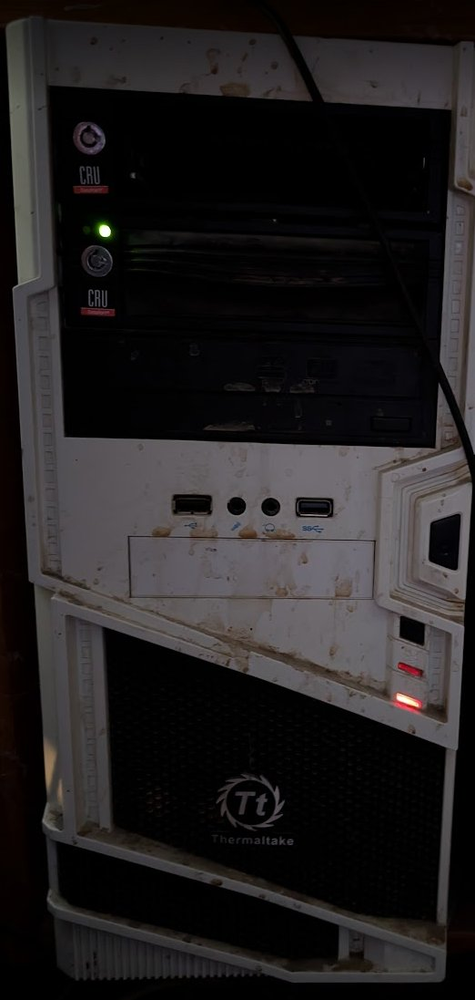{ width=300 } | **Role:** Restic backup server — pending Ubuntu 26.04 migration **Motherboard:** Gigabyte Z77-DS3H (Intel Z77, LGA1155) **CPU:** Intel Core i5-2500K @ 3.30GHz (Sandy Bridge 2011) **RAM:** 16GB DDR3 1600MHz (4x 4GB matched kit) **RAM max:** 32GB DDR3 (4x 8GB) — DDR3 is cheap, easy upgrade **BIOS:** AMI 2012-08-20 **OS:** Windows 10 (EOL) **Form factor:** Thermaltake white full tower — 2x CRU hot-swap bays, USB 3.0 front panel **Storage:** Disk 0: 238GB SSD (C: OS, 38% free) + Disk 1: 2.79TB HDD (D: Patreon O-Z, 10% free ⚠️) + DVD drive **Backup role:** Tier 1 — Restic automated backups from FreeNAS. Tier 2 — 2x CRU bays for rotating manual drives. Tier 3 — offsite cold storage via drive rotation. **Upgrade notes:** Upgrade RAM to 32GB before Ubuntu migration — you have old DDR3 stock. Add drives to CRU bays for backup capacity. |

---

## Raspberry Pis

| Photo | Hostname | IP | Model | CPU | RAM | Storage | Best Use | Status |
|-------|----------|----|-------|-----|-----|---------|----------|--------|
| 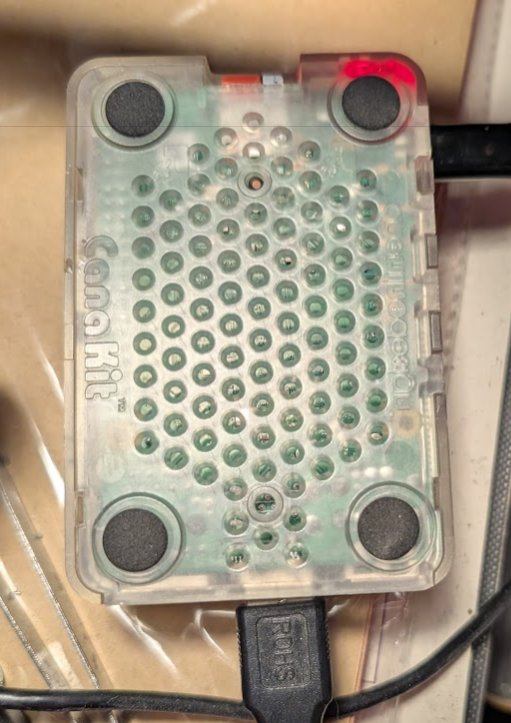{ width=100 } | octopi-deb | 192.168.1.122 | RPi 4 Model B Rev 1.1 (BCM2711) — CanaKit clear case | ARMv7 4-core | 3.7GB | 29GB SD (3.9GB used, 24GB free) | OctoPrint — controls Creality Ender 3 V2 3D printer | Online |
| 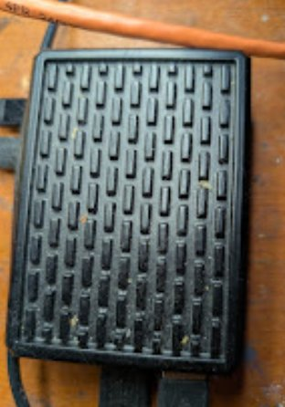{ width=100 } | batocera-deb | 192.168.1.123 | RPi 5 Model B Rev 1.0 | ARM 4-core | 3.9GB | 111GB SD (30GB used, 76GB free) | Best retro gaming — PS2, GameCube, Dreamcast, some Switch (Batocera) | Online |
| 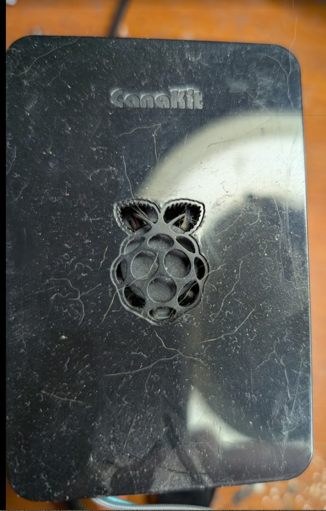{ width=100 } | ha-net | 192.168.1.125 (eth) / .115 (wlan) | RPi 4 Model B Rev 1.4 — CanaKit black case | ARM 4-core | 3.7GB | 28.6GB (7.4GB used, 27%) | Home Assistant OS 17.2 / Core 2026.4.2 | Online |
| 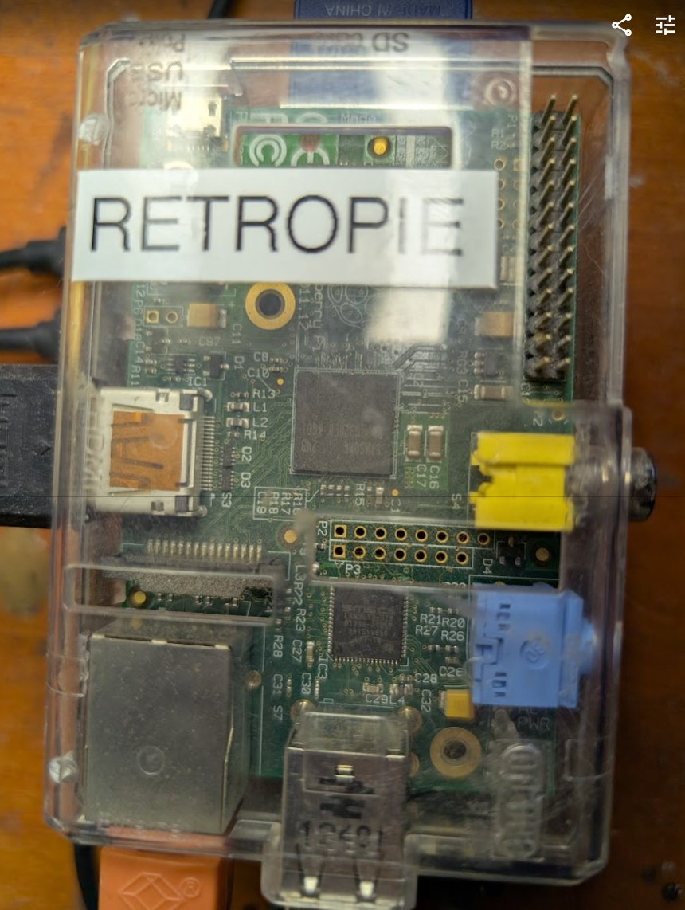{ width=100 } | pi1-deb | 192.168.1.120 | RPi Model B Rev 2 (BCM2835) Rev 000f — blue-green translucent case — 512MB | ARM 1-core | 427MB | 3.8GB SD (91% full ⚠️ — needs larger card) | Raspbian Bookworm, Python 3.11.2 — onboarded ✅ — Suggested: secondary PiHole (redundancy) or MQTT broker for HA/IoT | Online |
| 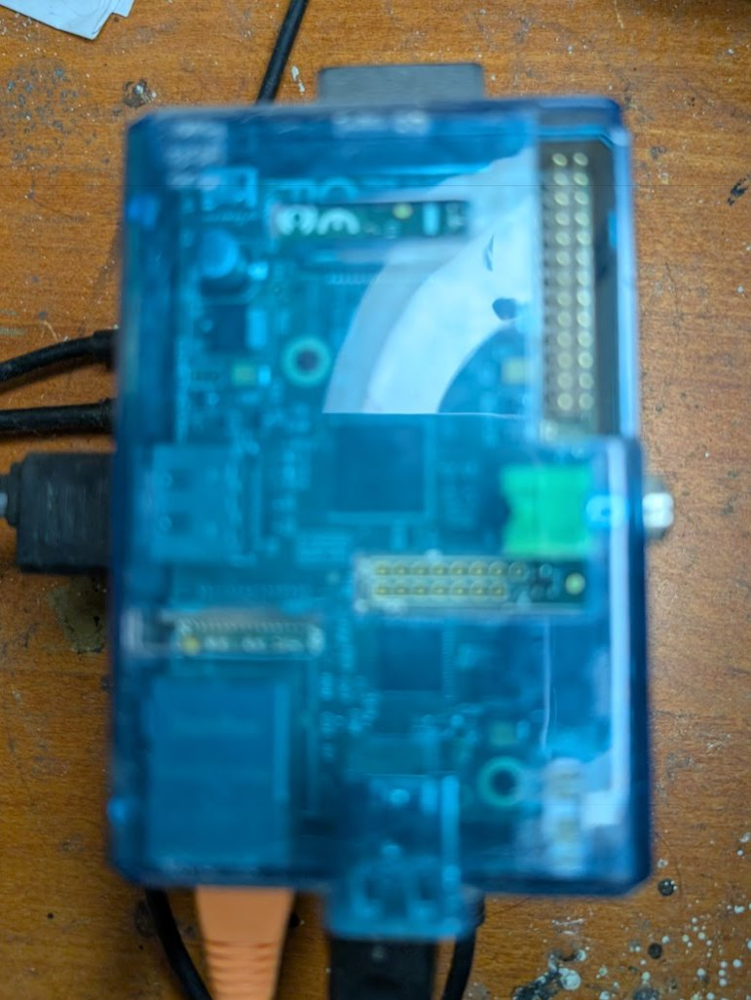{ width=100 } | pi2-deb | 192.168.1.121 | RPi Model B Rev 2 (BCM2835) Rev 000f — bare board — 512MB | ARM 1-core | 475MB | 7.2GB SD (2.4GB used) | DietPi — onboarded ✅ — Suggested: MQTT broker for Home Assistant IoT messaging | Online |
| 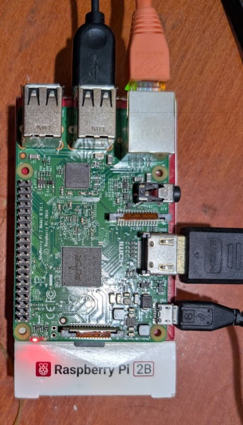{ width=100 } | pi4-deb | 192.168.1.126 | RPi 2 Model B Rev 1.1 (BCM2836) — official white case — 1GB | ARM 4-core | 762MB | 29GB SD (2.6GB used, 10%) | DietPi v10.2.3 — onboarded ✅ — Suggested: Zigbee coordinator + MQTT broker for Home Assistant | Online |
| 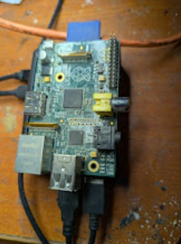{ width=100 } | pi3-deb | 192.168.1.124 | RPi Model B Rev 2 (BCM2835) Rev 000e — clear acrylic RETROPIE case — 256MB | ARM 1-core | 239MB | 15GB SD (3.4GB used, 11GB free) | RetroPie/Buster — legacy, cannot Ansible manage (Python 3.7) — Suggested: keep as RetroPie for NES/SNES/GB only (already set up) | Online |
| 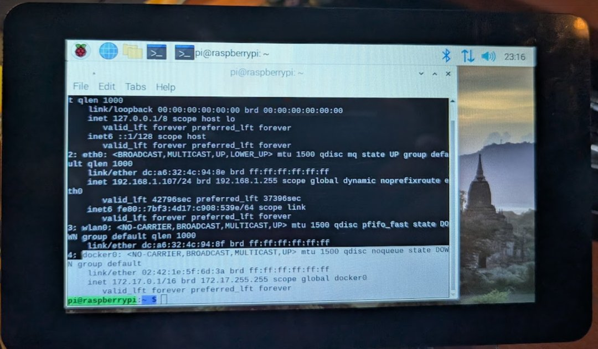{ width=100 } | argos-deb | 192.168.1.127 | RPi 4 Model B Rev 1.1 (BCM2711) — 1GB — ewaste find! | ARM 4-core | 870MB | 32GB PNY (Bookworm 64-bit) | Fully kitted IoT field station — see full section below | Online |

---

## argos-deb (192.168.1.127)

| | |
|--|--|
| { width=300 } | **Role:** IoT field station — TBD **Model:** Raspberry Pi 4 Model B Rev 1.1 (BCM2711) **RAM:** 1GB (870MB available) **Storage:** 32GB PNY microSD (Bookworm 64-bit) **OS:** Raspberry Pi OS Bookworm 64-bit — onboarded ✅ **IP:** 192.168.1.127 **Origin:** Ewaste find — someone's serious IoT project **Display:** Official Raspberry Pi 7" touchscreen ✅ working **Camera:** Raspberry Pi Camera V2.1 — untested on Bookworm **Cellular:** Sixfab mPCI-E Base Shield V2 + Quectel EC25-A 4G LTE — needs SIM card **Radio:** Adafruit RFM9x LoRa — long range RF, GPIO connected **Docker:** Pre-installed on original Buster image **Name:** Argos — the hundred-eyed giant of Greek mythology, always watching **Potential roles:** Mobile homelab node (Tailscale+LTE), LoRa gateway, security camera, HA kiosk display, field sensor station **Upgrade notes:** Add SIM card (Hologram.io), reconnect Sixfab shield, test LoRa radio |

---

## 3D Printers

| Photo | Printer | Type | Controller | Status | Notes |
|-------|---------|------|-----------|--------|-------|
| 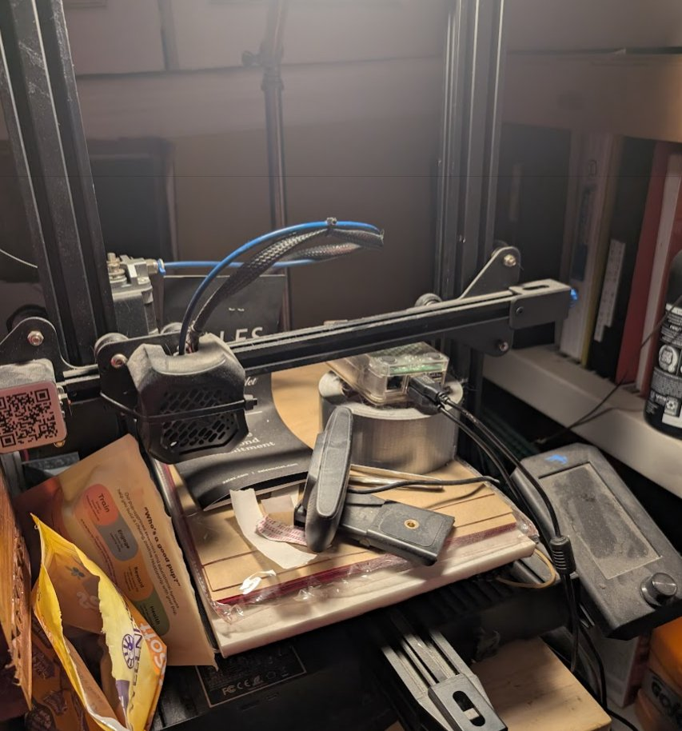{ width=100 } | Creality Ender 3 V2 | FDM | octopi-deb (OctoPrint) | ✅ Active | Controlled via RPi 4 |
| 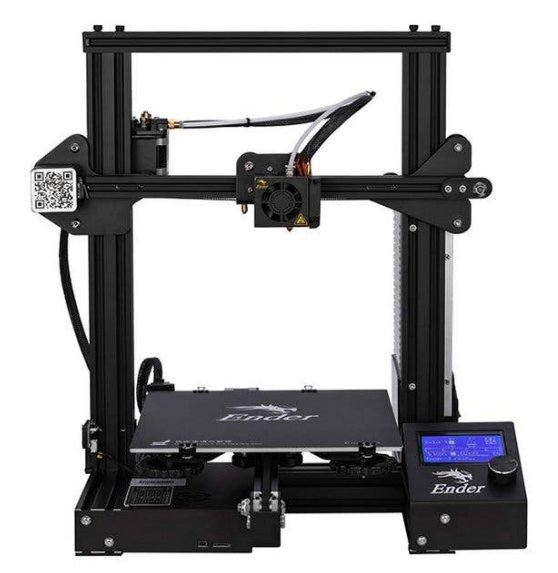{ width=100 } | Creality Ender 3 V1 | FDM | None assigned | Needs Pi | Could add another OctoPrint Pi |
| 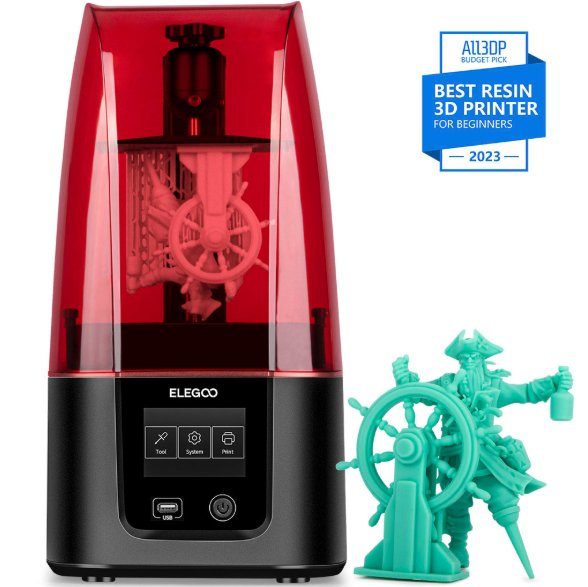{ width=100 } | Elegoo Mars 3 | Resin (MSLA) | None | Standalone | Chitubox slicer, no OctoPrint |
| 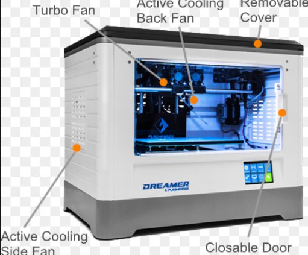{ width=100 } | Flashforge Dreamer | FDM dual extrusion | None | Standalone | FlashPrint software |

---

| Photo | Item | Qty | VRAM | Notes |
|-------|------|-----|------|-------|
| 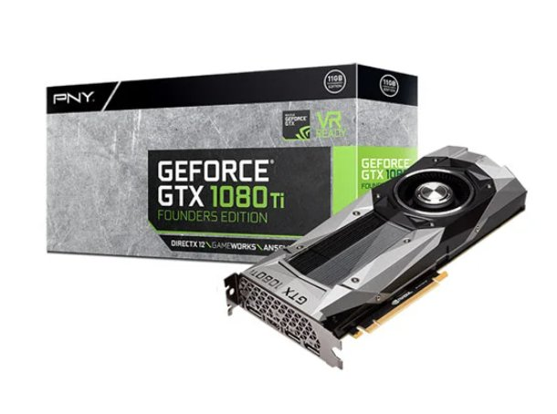{ width=100 } | GTX 1080 Ti | 4-5 total (1 in amontillado, 3-4 undeployed) | 11GB VRAM | Best choice for AI/Ollama node — more VRAM than 1080 |
| { width=100 } | GTX 1080 | 4 (undeployed) | 8GB each | Pascal NVENC — 1 transcode stream, no AV1 |

---

## 6 Waiting Systems

| Photo | # | Make/Model | CPU | RAM | Storage | Planned Role |
|-------|---|-----------|-----|-----|---------|--------------|
| 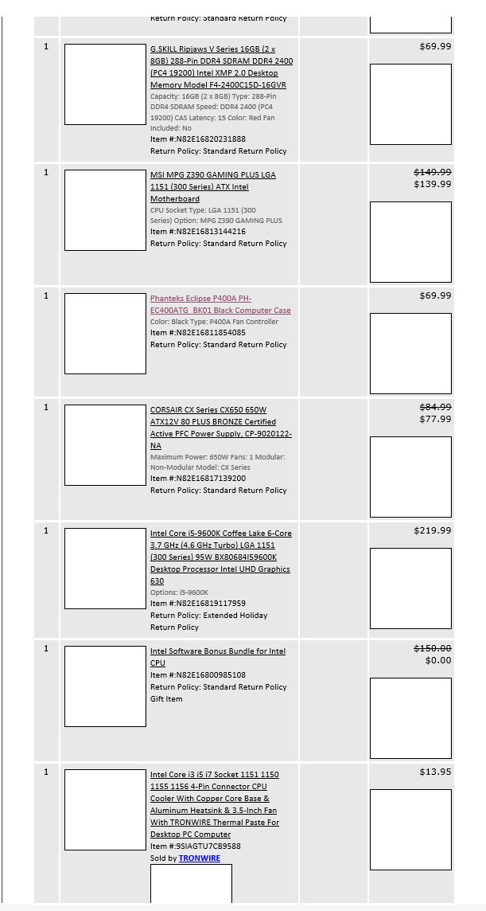{ width=100 } | 1 | Phanteks P400A / MSI MPG Z390 GAMING PLUS | Intel i5-9600K (6c, 4.6GHz) | 16GB DDR4 2400 G.Skill Ripjaws V | Unknown | TBD |
| { width=100 } | 2 | TBD | TBD | TBD | TBD | TBD |
| { width=100 } | 3 | TBD | TBD | TBD | TBD | TBD |
| { width=100 } | 4 | TBD | TBD | TBD | TBD | TBD |
| { width=100 } | 5 | TBD | TBD | TBD | TBD | TBD |
| { width=100 } | 6 | TBD | TBD | TBD | TBD | TBD |

---

## To Do
- [ ] Save proxmox-deb photo to `docs/images/hw/proxmox-deb.jpg` *(photo taken)*
- [ ] Enable SSH on freenas-bsd and run dmidecode
- [ ] Confirm git-ansible physical host specs with dmidecode
- [ ] Run Get-ComputerInfo on eld-win
- [ ] Physically inventory the 6 waiting systems
- [ ] Take photos of all remaining hosts
- [ ] Import into Snipe-IT (192.168.1.20)

