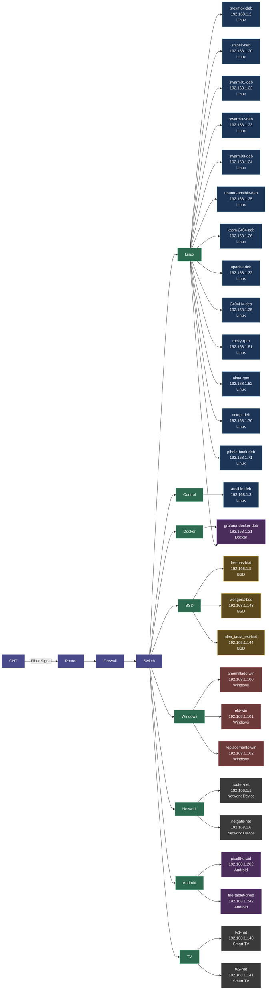

# Network Diagram

_Last update: 2026-04-05 16:10:01_

```mermaid
graph LR

    ONT[ONT]
    Router[Router]
    Firewall[Firewall]
    Switch[Switch]

    ONT -->|Fiber Signal| Router
    Router --> Firewall
    Firewall --> Switch

    GRP_linux[Linux]
    Switch --> GRP_linux

    proxmox_deb["proxmox-deb<br/>192.168.1.2<br/>Linux"]
    GRP_linux --> proxmox_deb
    snipeit_deb["snipeit-deb<br/>192.168.1.20<br/>Linux"]
    GRP_linux --> snipeit_deb
    grafana_docker_deb["grafana-docker-deb<br/>192.168.1.21<br/>Linux"]
    GRP_linux --> grafana_docker_deb
    swarm01_deb["swarm01-deb<br/>192.168.1.22<br/>Linux"]
    GRP_linux --> swarm01_deb
    swarm02_deb["swarm02-deb<br/>192.168.1.23<br/>Linux"]
    GRP_linux --> swarm02_deb
    swarm03_deb["swarm03-deb<br/>192.168.1.24<br/>Linux"]
    GRP_linux --> swarm03_deb
    ubuntu_ansible_deb["ubuntu-ansible-deb<br/>192.168.1.25<br/>Linux"]
    GRP_linux --> ubuntu_ansible_deb
    kasm_2404_deb["kasm-2404-deb<br/>192.168.1.26<br/>Linux"]
    GRP_linux --> kasm_2404_deb
    apache_deb["apache-deb<br/>192.168.1.32<br/>Linux"]
    GRP_linux --> apache_deb
    2404HV_deb["2404HV-deb<br/>192.168.1.35<br/>Linux"]
    GRP_linux --> 2404HV_deb
    rocky_rpm["rocky-rpm<br/>192.168.1.51<br/>Linux"]
    GRP_linux --> rocky_rpm
    alma_rpm["alma-rpm<br/>192.168.1.52<br/>Linux"]
    GRP_linux --> alma_rpm
    octopi_deb["octopi-deb<br/>192.168.1.70<br/>Linux"]
    GRP_linux --> octopi_deb
    pihole_book_deb["pihole-book-deb<br/>192.168.1.71<br/>Linux"]
    GRP_linux --> pihole_book_deb

    GRP_control[Control]
    Switch --> GRP_control

    ansible_deb["ansible-deb<br/>192.168.1.3<br/>Linux"]
    GRP_control --> ansible_deb

    GRP_bsd[BSD]
    Switch --> GRP_bsd

    freenas_bsd["freenas-bsd<br/>192.168.1.5<br/>BSD"]
    GRP_bsd --> freenas_bsd
    weltgeist_bsd["weltgeist-bsd<br/>192.168.1.143<br/>BSD"]
    GRP_bsd --> weltgeist_bsd
    alea_iacta_est_bsd["alea_iacta_est-bsd<br/>192.168.1.144<br/>BSD"]
    GRP_bsd --> alea_iacta_est_bsd

    GRP_windows[Windows]
    Switch --> GRP_windows

    amontillado_win["amontillado-win<br/>192.168.1.100<br/>Windows"]
    GRP_windows --> amontillado_win
    eld_win["eld-win<br/>192.168.1.101<br/>Windows"]
    GRP_windows --> eld_win
    replacements_win["replacements-win<br/>192.168.1.102<br/>Windows"]
    GRP_windows --> replacements_win

    GRP_network[Network]
    Switch --> GRP_network

    router_net["router-net<br/>192.168.1.1<br/>Network Device"]
    GRP_network --> router_net
    netgate_net["netgate-net<br/>192.168.1.6<br/>Network Device"]
    GRP_network --> netgate_net

    GRP_android[Android]
    Switch --> GRP_android

    pixel8_droid["pixel8-droid<br/>192.168.1.202<br/>Android"]
    GRP_android --> pixel8_droid
    fire_tablet_droid["fire-tablet-droid<br/>192.168.1.242<br/>Android"]
    GRP_android --> fire_tablet_droid

    GRP_tv[TV]
    Switch --> GRP_tv

    tv1_net["tv1-net<br/>192.168.1.140<br/>Smart TV"]
    GRP_tv --> tv1_net
    tv2_net["tv2-net<br/>192.168.1.141<br/>Smart TV"]
    GRP_tv --> tv2_net

    GRP_docker[Docker]
    Switch --> GRP_docker

    grafana_docker_deb["grafana-docker-deb<br/>192.168.1.21<br/>Docker"]
    GRP_docker --> grafana_docker_deb

    classDef infra fill:#4a4a8a,stroke:#9999cc,color:#fff
    classDef group fill:#2d6a4f,stroke:#74c69d,color:#fff
    classDef linux fill:#1d3557,stroke:#457b9d,color:#fff
    classDef windows fill:#6d3a3a,stroke:#c1666b,color:#fff
    classDef bsd fill:#5c4a1e,stroke:#d4a017,color:#fff
    classDef network fill:#3a3a3a,stroke:#888,color:#fff
    classDef other fill:#4a2d5a,stroke:#9b72cf,color:#fff

    class ONT,Router,Firewall,Switch infra
    class GRP_linux group
    class proxmox_deb linux
    class snipeit_deb linux
    class grafana_docker_deb linux
    class swarm01_deb linux
    class swarm02_deb linux
    class swarm03_deb linux
    class ubuntu_ansible_deb linux
    class kasm_2404_deb linux
    class apache_deb linux
    class 2404HV_deb linux
    class rocky_rpm linux
    class alma_rpm linux
    class octopi_deb linux
    class pihole_book_deb linux
    class GRP_control group
    class ansible_deb linux
    class GRP_bsd group
    class freenas_bsd bsd
    class weltgeist_bsd bsd
    class alea_iacta_est_bsd bsd
    class GRP_windows group
    class amontillado_win windows
    class eld_win windows
    class replacements_win windows
    class GRP_network group
    class router_net network
    class netgate_net network
    class GRP_android group
    class pixel8_droid other
    class fire_tablet_droid other
    class GRP_tv group
    class tv1_net network
    class tv2_net network
    class GRP_docker group
    class grafana_docker_deb other
```
