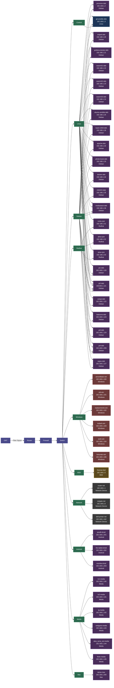

# Network Diagram

_Last update: 2026-04-12 02:10:01_

```mermaid
graph LR

    ONT[ONT]
    Router[Router]
    Firewall[Firewall]
    Switch[Switch]

    ONT -->|Fiber Signal| Router
    Router --> Firewall
    Firewall --> Switch

    GRP_linux[Linux]
    Switch --> GRP_linux

    proxmox_deb["proxmox-deb<br/>192.168.1.2<br/>Linux"]
    GRP_linux --> proxmox_deb
    git_ansible_deb["git-ansible-deb<br/>192.168.1.3<br/>Linux"]
    GRP_linux --> git_ansible_deb
    snipeit_deb["snipeit-deb<br/>192.168.1.20<br/>Linux"]
    GRP_linux --> snipeit_deb
    grafana_docker_deb["grafana-docker-deb<br/>192.168.1.21<br/>Linux"]
    GRP_linux --> grafana_docker_deb
    swarm01_deb["swarm01-deb<br/>192.168.1.22<br/>Linux"]
    GRP_linux --> swarm01_deb
    swarm02_deb["swarm02-deb<br/>192.168.1.23<br/>Linux"]
    GRP_linux --> swarm02_deb
    swarm03_deb["swarm03-deb<br/>192.168.1.24<br/>Linux"]
    GRP_linux --> swarm03_deb
    ubuntu_ansible_deb["ubuntu-ansible-deb<br/>192.168.1.25<br/>Linux"]
    GRP_linux --> ubuntu_ansible_deb
    kasm_2404_deb["kasm-2404-deb<br/>192.168.1.26<br/>Linux"]
    GRP_linux --> kasm_2404_deb
    apache_deb["apache-deb<br/>192.168.1.32<br/>Linux"]
    GRP_linux --> apache_deb
    pihole_book_deb["pihole-book-deb<br/>192.168.1.33<br/>Linux"]
    GRP_linux --> pihole_book_deb
    docker_deb["docker-deb<br/>192.168.1.34<br/>Linux"]
    GRP_linux --> docker_deb
    2404HV_deb["2404HV-deb<br/>192.168.1.35<br/>Linux"]
    GRP_linux --> 2404HV_deb
    mediastack_deb["mediastack-deb<br/>192.168.1.36<br/>Linux"]
    GRP_linux --> mediastack_deb
    mediastack_deb["mediastack-deb<br/>192.168.1.36<br/>Linux"]
    GRP_linux --> mediastack_deb
    rocky_rpm["rocky-rpm<br/>192.168.1.51<br/>Linux"]
    GRP_linux --> rocky_rpm
    alma_rpm["alma-rpm<br/>192.168.1.52<br/>Linux"]
    GRP_linux --> alma_rpm
    plow_rpm["plow-rpm<br/>192.168.1.53<br/>Linux"]
    GRP_linux --> plow_rpm
    pi1_deb["pi1-deb<br/>192.168.1.120<br/>Linux"]
    GRP_linux --> pi1_deb
    pi2_deb["pi2-deb<br/>192.168.1.121<br/>Linux"]
    GRP_linux --> pi2_deb
    octopi_deb["octopi-deb<br/>192.168.1.122<br/>Linux"]
    GRP_linux --> octopi_deb
    batocera_deb["batocera-deb<br/>192.168.1.123<br/>Linux"]
    GRP_linux --> batocera_deb
    pi2_deb["pi2-deb<br/>192.168.1.124<br/>Linux"]
    GRP_linux --> pi2_deb
    pi3_deb["pi3-deb<br/>192.168.1.124<br/>Linux"]
    GRP_linux --> pi3_deb
    pi4_deb["pi4-deb<br/>192.168.1.126<br/>Linux"]
    GRP_linux --> pi4_deb
    argos_deb["argos-deb<br/>192.168.1.127<br/>Linux"]
    GRP_linux --> argos_deb
    pi4_deb["pi4-deb<br/>192.168.1.209<br/>Linux"]
    GRP_linux --> pi4_deb
    pi1_deb["pi1-deb<br/>192.168.1.120<br/>Linux"]
    GRP_linux --> pi1_deb
    pi2_deb["pi2-deb<br/>192.168.1.121<br/>Linux"]
    GRP_linux --> pi2_deb

    GRP_windows[Windows]
    Switch --> GRP_windows

    amontillado_win["amontillado-win<br/>192.168.1.100<br/>Windows"]
    GRP_windows --> amontillado_win
    eld_win["eld-win<br/>192.168.1.101<br/>Windows"]
    GRP_windows --> eld_win
    replacements_win["replacements-win<br/>192.168.1.102<br/>Windows"]
    GRP_windows --> replacements_win
    todash_win["todash-win<br/>192.168.1.103<br/>Windows"]
    GRP_windows --> todash_win
    work_win["work-win<br/>192.168.1.104<br/>Windows"]
    GRP_windows --> work_win
    fortunato_win["fortunato-win<br/>192.168.1.106<br/>Windows"]
    GRP_windows --> fortunato_win

    GRP_bsd[BSD]
    Switch --> GRP_bsd

    freenas_bsd["freenas-bsd<br/>192.168.1.5<br/>BSD"]
    GRP_bsd --> freenas_bsd

    GRP_network[Network]
    Switch --> GRP_network

    router_net["router-net<br/>192.168.1.1<br/>Network Device"]
    GRP_network --> router_net
    netgate_net["netgate-net<br/>192.168.1.6<br/>Network Device"]
    GRP_network --> netgate_net
    dell_printer_net["dell-printer-net<br/>192.168.1.162<br/>Network Device"]
    GRP_network --> dell_printer_net

    GRP_android[Android]
    Switch --> GRP_android

    pixel8_droid["pixel8-droid<br/>192.168.1.201<br/>Android"]
    GRP_android --> pixel8_droid
    fire_tablet_droid["fire-tablet-droid<br/>192.168.1.202<br/>Android"]
    GRP_android --> fire_tablet_droid
    roomba_droid["roomba-droid<br/>192.168.1.203<br/>Android"]
    GRP_android --> roomba_droid

    GRP_media[Media]
    Switch --> GRP_media

    tv1_media["tv1-media<br/>192.168.1.140<br/>Media"]
    GRP_media --> tv1_media
    tv2_media["tv2-media<br/>192.168.1.141<br/>Media"]
    GRP_media --> tv2_media
    lg_media["lg-media<br/>192.168.1.142<br/>Media"]
    GRP_media --> lg_media
    weltgeist_media["weltgeist-media<br/>192.168.1.143<br/>Media"]
    GRP_media --> weltgeist_media
    alea_iacta_est_media["alea_iacta_est-media<br/>192.168.1.144<br/>Media"]
    GRP_media --> alea_iacta_est_media
    firetv_media["firetv-media<br/>192.168.1.145<br/>Media"]
    GRP_media --> firetv_media

    GRP_mac[Mac]
    Switch --> GRP_mac

    tahoe_mac["tahoe-mac<br/>192.168.1.200<br/>Mac"]
    GRP_mac --> tahoe_mac

    GRP_debian[Debian]
    Switch --> GRP_debian

    proxmox_deb["proxmox-deb<br/>192.168.1.2<br/>Debian"]
    GRP_debian --> proxmox_deb
    git_ansible_deb["git-ansible-deb<br/>192.168.1.3<br/>Debian"]
    GRP_debian --> git_ansible_deb
    snipeit_deb["snipeit-deb<br/>192.168.1.20<br/>Debian"]
    GRP_debian --> snipeit_deb
    grafana_docker_deb["grafana-docker-deb<br/>192.168.1.21<br/>Debian"]
    GRP_debian --> grafana_docker_deb
    swarm01_deb["swarm01-deb<br/>192.168.1.22<br/>Debian"]
    GRP_debian --> swarm01_deb
    swarm02_deb["swarm02-deb<br/>192.168.1.23<br/>Debian"]
    GRP_debian --> swarm02_deb
    swarm03_deb["swarm03-deb<br/>192.168.1.24<br/>Debian"]
    GRP_debian --> swarm03_deb
    ubuntu_ansible_deb["ubuntu-ansible-deb<br/>192.168.1.25<br/>Debian"]
    GRP_debian --> ubuntu_ansible_deb
    kasm_2404_deb["kasm-2404-deb<br/>192.168.1.26<br/>Debian"]
    GRP_debian --> kasm_2404_deb
    apache_deb["apache-deb<br/>192.168.1.32<br/>Debian"]
    GRP_debian --> apache_deb
    pihole_book_deb["pihole-book-deb<br/>192.168.1.33<br/>Debian"]
    GRP_debian --> pihole_book_deb
    docker_deb["docker-deb<br/>192.168.1.34<br/>Debian"]
    GRP_debian --> docker_deb
    2404HV_deb["2404HV-deb<br/>192.168.1.35<br/>Debian"]
    GRP_debian --> 2404HV_deb
    mediastack_deb["mediastack-deb<br/>192.168.1.36<br/>Debian"]
    GRP_debian --> mediastack_deb
    mediastack_deb["mediastack-deb<br/>192.168.1.36<br/>Debian"]
    GRP_debian --> mediastack_deb
    pi1_deb["pi1-deb<br/>192.168.1.120<br/>Debian"]
    GRP_debian --> pi1_deb
    pi2_deb["pi2-deb<br/>192.168.1.121<br/>Debian"]
    GRP_debian --> pi2_deb
    octopi_deb["octopi-deb<br/>192.168.1.122<br/>Debian"]
    GRP_debian --> octopi_deb
    batocera_deb["batocera-deb<br/>192.168.1.123<br/>Debian"]
    GRP_debian --> batocera_deb
    pi2_deb["pi2-deb<br/>192.168.1.124<br/>Debian"]
    GRP_debian --> pi2_deb
    pi3_deb["pi3-deb<br/>192.168.1.124<br/>Debian"]
    GRP_debian --> pi3_deb
    pi4_deb["pi4-deb<br/>192.168.1.126<br/>Debian"]
    GRP_debian --> pi4_deb
    argos_deb["argos-deb<br/>192.168.1.127<br/>Debian"]
    GRP_debian --> argos_deb
    pi4_deb["pi4-deb<br/>192.168.1.209<br/>Debian"]
    GRP_debian --> pi4_deb
    pi2_deb["pi2-deb<br/>192168.1.121<br/>Debian"]
    GRP_debian --> pi2_deb

    GRP_redhat[Redhat]
    Switch --> GRP_redhat

    rocky_rpm["rocky-rpm<br/>192.168.1.51<br/>Redhat"]
    GRP_redhat --> rocky_rpm
    alma_rpm["alma-rpm<br/>192.168.1.52<br/>Redhat"]
    GRP_redhat --> alma_rpm
    plow_rpm["plow-rpm<br/>192.168.1.53<br/>Redhat"]
    GRP_redhat --> plow_rpm

    GRP_control[Control]
    Switch --> GRP_control

    git_ansible_deb["git-ansible-deb<br/>192.168.1.3<br/>Linux"]
    GRP_control --> git_ansible_deb

    classDef infra fill:#4a4a8a,stroke:#9999cc,color:#fff
    classDef group fill:#2d6a4f,stroke:#74c69d,color:#fff
    classDef linux fill:#1d3557,stroke:#457b9d,color:#fff
    classDef windows fill:#6d3a3a,stroke:#c1666b,color:#fff
    classDef bsd fill:#5c4a1e,stroke:#d4a017,color:#fff
    classDef network fill:#3a3a3a,stroke:#888,color:#fff
    classDef other fill:#4a2d5a,stroke:#9b72cf,color:#fff

    class ONT,Router,Firewall,Switch infra
    class GRP_linux group
    class proxmox_deb linux
    class git_ansible_deb linux
    class snipeit_deb linux
    class grafana_docker_deb linux
    class swarm01_deb linux
    class swarm02_deb linux
    class swarm03_deb linux
    class ubuntu_ansible_deb linux
    class kasm_2404_deb linux
    class apache_deb linux
    class pihole_book_deb linux
    class docker_deb linux
    class 2404HV_deb linux
    class mediastack_deb linux
    class mediastack_deb linux
    class rocky_rpm linux
    class alma_rpm linux
    class plow_rpm linux
    class pi1_deb linux
    class pi2_deb linux
    class octopi_deb linux
    class batocera_deb linux
    class pi2_deb linux
    class pi3_deb linux
    class pi4_deb linux
    class argos_deb linux
    class pi4_deb linux
    class pi1_deb linux
    class pi2_deb linux
    class GRP_windows group
    class amontillado_win windows
    class eld_win windows
    class replacements_win windows
    class todash_win windows
    class work_win windows
    class fortunato_win windows
    class GRP_bsd group
    class freenas_bsd bsd
    class GRP_network group
    class router_net network
    class netgate_net network
    class dell_printer_net network
    class GRP_android group
    class pixel8_droid other
    class fire_tablet_droid other
    class roomba_droid other
    class GRP_media group
    class tv1_media other
    class tv2_media other
    class lg_media other
    class weltgeist_media other
    class alea_iacta_est_media other
    class firetv_media other
    class GRP_mac group
    class tahoe_mac other
    class GRP_debian group
    class proxmox_deb other
    class git_ansible_deb other
    class snipeit_deb other
    class grafana_docker_deb other
    class swarm01_deb other
    class swarm02_deb other
    class swarm03_deb other
    class ubuntu_ansible_deb other
    class kasm_2404_deb other
    class apache_deb other
    class pihole_book_deb other
    class docker_deb other
    class 2404HV_deb other
    class mediastack_deb other
    class mediastack_deb other
    class pi1_deb other
    class pi2_deb other
    class octopi_deb other
    class batocera_deb other
    class pi2_deb other
    class pi3_deb other
    class pi4_deb other
    class argos_deb other
    class pi4_deb other
    class pi2_deb other
    class GRP_redhat group
    class rocky_rpm other
    class alma_rpm other
    class plow_rpm other
    class GRP_control group
    class git_ansible_deb linux
```
